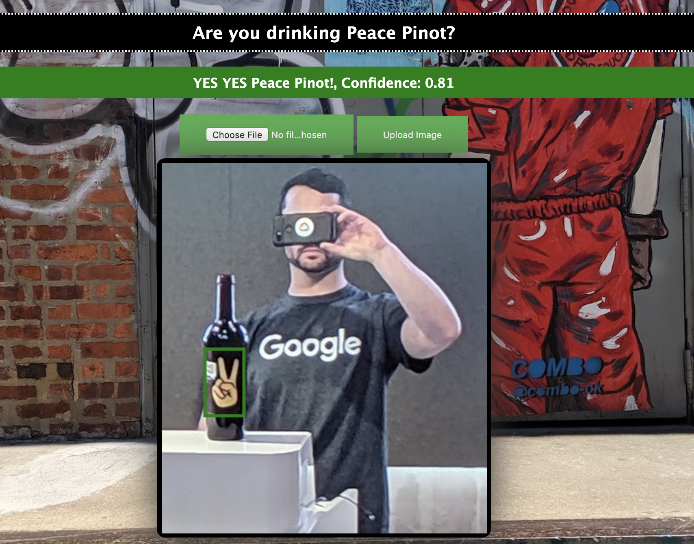

# PeacePinot Demo


## Google Cloud AutoML Object Detection Demo on Node.js

### Add your own settings in the following section of the app.js files

```javascript

const port       = 8080;
var gcsBucket = "bkauf-peacepinot";//name of GCS Bucket make sure access it public
var gcsFolder = "uploads";//not implemented yet
var project   = "bkauf-sandbox";//GCP Project
var saToken   = "/usr/src/app/token.json";//location of service account JSON
const region = 'us-central1';//region of autoML model
const automlModel = 'IOD822197203064848384';//autoML model ID

```
# Once you have the credential spec in the root directory you can create a docker image for the application

```console
 docker build -t peacepinot:1.0 .
```



