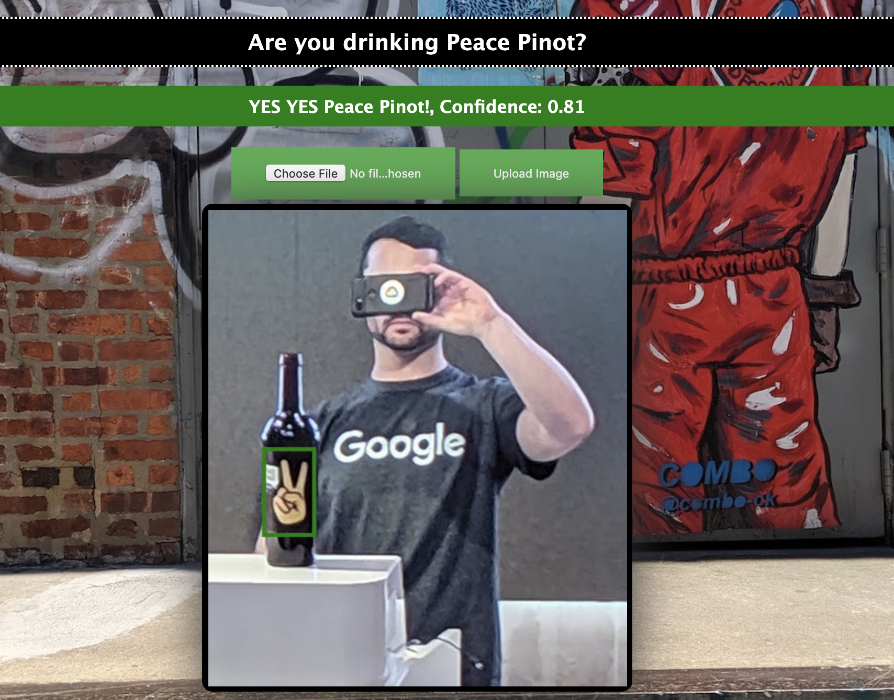

# PeacePinot Demo


## Google Cloud AutoML Object Detection Demo on Node.js

### Add your own settings in the following section of the app.js files

```javascript

const port       = 8080;
var gcsBucket = 'bkauf-peacepinot';//GCS Bucket to upload images- make sure access is public
var gcsFolder = 'uploads';//not implemented yet
var project   = 'bkauf-sandbox';//GCP Project Where Model is
var saToken   = '/var/run/secret/cloud.google.com/service-account.json';//location of service account JSON. K8s secret config below
const region = 'us-central1';//region of autoML model
const automlModel = 'IOD822197203064848384';//autoML model ID

```
# Once you have the credential spec in the root directory you can create a docker image for the application

```console
 docker build -t peacepinot:1.0 .
```

In your cluster create a secret with the JSON file of a service account with the correct ML rollingUpdate

```console
kubectl create secret generic peacepinot --from-file service-account.json
```


